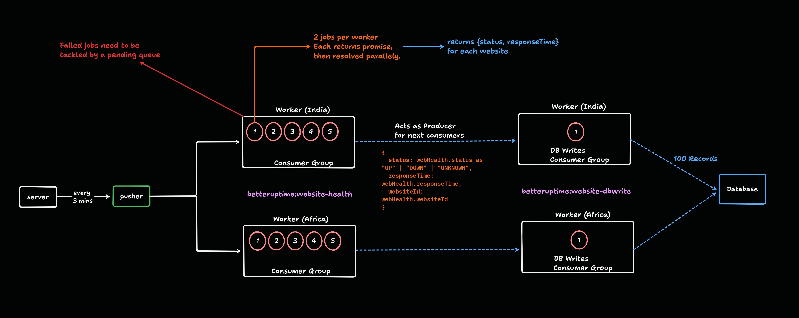

# BetterUpTime

A distributed website uptime monitoring system built in a Bun monorepo with Redis Streams, regional health-check workers, and a stream-based write pipeline.



> added websites health check workers which will be consumer groups of redis streams , and will be deployed in various regions for checking the website health from different regions distributed among workers within that region.

## Why This Architecture

BetterUpTime separates monitoring into pipeline stages so each part can scale independently:

- Website jobs are pushed into Redis Streams.
- Health checks are processed by regional workers using consumer groups.
- Results are handed off through Redis for durable processing.
- Database persistence is isolated from probing logic.

This keeps website checks fast and limits direct write pressure on the primary database.

## Monorepo Structure

### Apps

- apps/api: API layer.
- apps/pusher: Pushes website check jobs to Redis Streams.
- apps/checkhealth-worker: Pulls jobs, checks website health, and forwards result events.
- apps/web: Next.js frontend.

### Shared Packages

- packages/redis-streams: Redis Streams helpers for add, read-group, and ack flows.
- packages/store: Prisma schema and DB client.
- packages/ui: Shared UI components.
- packages/eslint-config, packages/typescript-config: Shared tooling config.

## Event Flow

1. Pusher fetches websites and publishes check events.
2. Regional checkhealth workers consume those events from their region-aligned consumer group.
3. Workers compute status and response time.
4. Workers publish health result events to a DB-write stream.
5. Source messages are acknowledged only after successful handoff.
6. A DB writer module consumes result events and persists to Postgres.

## Local Setup

### 1) Install dependencies

```bash
bun install
```

### 2) Start the web app

```bash
cd apps/web && bun run dev
```

### 3) Start API

```bash
cd apps/api && bun run index.ts
```

### 4) Start pusher

```bash
cd apps/pusher && bun run index.ts
```

### 5) Start one health-check worker

```bash
cd apps/checkhealth-worker && bun run index.ts
```

You can start multiple worker instances with different WORKER_ID values to simulate horizontal scaling in a region.

## Required Environment Variables

Set these in each service where applicable:

- STREAM_NAME: Source website-check stream.
- DB_WRITE_STREAM_NAME: Result handoff stream for DB writer.
- REGION_ID: Region/group identifier for regional workers.
- WORKER_ID: Unique consumer name per worker instance.
- DATABASE_URL: Postgres connection string (for services that write/read DB).

## Scripts

From repository root:

```bash
bun run dev
bun run build
bun run lint
bun run check-types
```

## Tech Stack

- Bun
- TypeScript
- Turbo
- Redis Streams
- PostgreSQL
- Prisma
- Express
- Next.js

## Current Goal

Build a reliable multi-region uptime pipeline where regional workers probe websites, hand off results through Redis Streams, and persistence is handled by a dedicated writer module.
